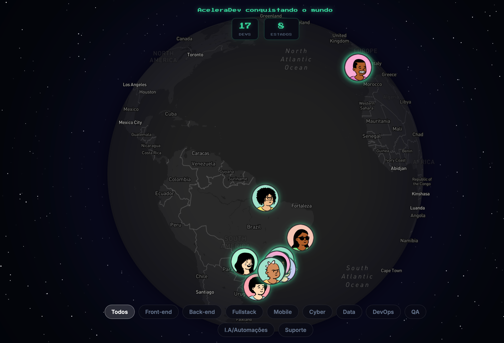

# AceleraDev Globe

<p align="center">
  
</p>

An interactive 3D globe that visualizes real career outcomes from [AceleraDev](https://aceleradev.com.br) — a tech career acceleration program. Each marker on the map represents a real developer who landed their first tech job, switched careers, or achieved a significant salary increase. All data is anonymized with generated avatars and fictional names, but the results are real.

## Features

- **Interactive 3D Globe** — built with Mapbox GL JS, navigate and explore developers across Brazil and worldwide
- **Filter by Area** — Frontend, Backend, Fullstack, Mobile, Cybersecurity, Data, DevOps, QA, AI/Automation, Support
- **Developer Cards** — click any marker to see individual stories: area, city, seniority, salary range, and key career insights
- **Live Stats** — real-time counters for total developers and states represented

## Tech Stack

| Layer | Technology |
|-------|-----------|
| Frontend | React 18, TypeScript, Vite, Tailwind CSS, Mapbox GL JS |
| Backend | Java 17, Quarkus 3.9, Hibernate ORM, Flyway |
| Database | PostgreSQL 16 |
| Infrastructure | Docker, Traefik v3, Coraza WAF, Let's Encrypt |

## Architecture

```
Browser → Traefik (TLS + WAF + Rate Limit) → Frontend (Nginx)
                                            → Backend (Quarkus) → PostgreSQL
```

- **Traefik** handles TLS termination, rate limiting (20 req/s per IP), security headers, and WAF (Coraza + OWASP CRS)
- **Frontend** is a static SPA served by Nginx, renders the 3D globe with Mapbox
- **Backend** exposes a REST API with cache (Caffeine), admin authentication, and automatic database migrations via Flyway
- **Avatars** are dynamically generated using DiceBear based on developer profile
- **Geocoding** uses Nominatim for coordinate resolution with randomized offset for privacy

## Running Locally

```bash
# 1. Start the database
docker compose up -d

# 2. Start the backend
cd backend
mvn quarkus:dev

# 3. Start the frontend
cd frontend
npm install
npm run dev
```

Create a `.env` file in `frontend/` with your Mapbox token:
```
VITE_MAPBOX_TOKEN=pk.your_token_here
```

## API Endpoints

| Method | Endpoint | Description |
|--------|----------|-------------|
| GET | `/api/students` | List all students (globe markers) |
| GET | `/api/students/{id}` | Get student details (card) |
| GET | `/api/students/stats` | Get total students and states count |
| POST | `/api/admin/students` | Create student (admin) |
| PUT | `/api/admin/students/{id}` | Update student (admin) |
| DELETE | `/api/admin/students/{id}` | Delete student (admin) |

Admin endpoints require `X-Admin-Token` header.

## License

MIT
